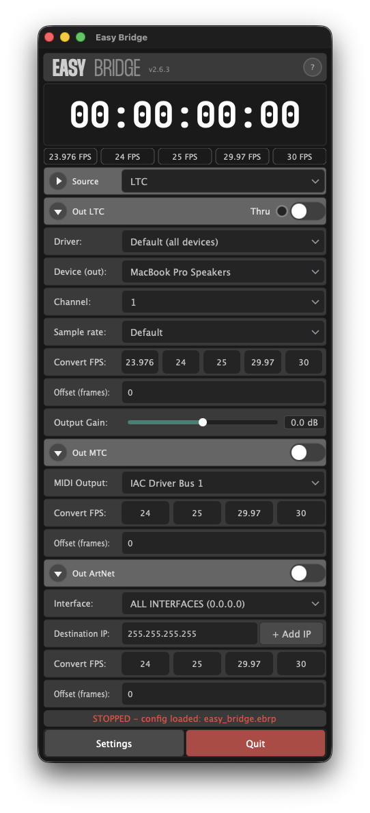

# Easy Bridge

**Easy Bridge** is a cross-platform desktop application for converting and routing timecode between different formats used in live production, broadcast, and post-production workflows.

Receive timecode in one format — send it out in another, simultaneously, with minimal latency.


[](LICENSE)

## Screenshot



---

## Supported formats

| Direction | LTC | MTC | ArtNet TC | OSC | System Time |
|-----------|:---:|:---:|:---------:|:---:|:-----------:|
| Input     | ✓   | ✓   | ✓         | ✓   | ✓           |
| Output    | ✓   | ✓   | ✓         |     |

- **LTC** — Linear Timecode over audio (ASIO / WDM / CoreAudio)
- **MTC** — MIDI Timecode (any MIDI interface)
- **ArtNet TC** — Timecode over Ethernet via the ArtNet protocol
- **OSC** — Open Sound Control (receive timecode from OSC-capable software)
- **System Time** — generate input timecode from the local computer clock

## Recent updates

- Input FPS strip under the main clock now shows `23.976 / 24 / 25 / 29.97 / 30`.
- `LTC In` and `LTC Out` now use the real audio channel count from the selected device, including stereo pairs such as `1+2`, `3+4`, and more when available.
- `LTC Out`, `MTC Out`, and `ArtNet Out` now support per-output FPS conversion.
- `ArtNet Out` now supports up to 5 send targets, each with its own destination IP and collapsible adapter selection.
- Built-in update checking now runs on startup and from `Help -> Check for Updates`.
- On Windows, `Update Now` downloads the latest installer and starts a silent update after Easy Bridge closes.
- On macOS, `Update Now` downloads and opens the latest `.dmg` so the app can be replaced cleanly.
- The temporary `Ableton Link` experiment was removed. Current sources remain `LTC`, `MTC`, `ArtNet`, `OSC`, and `System Time`.

---

## Download

Pre-built installers are attached to each [GitHub Release](../../releases/latest):

| Platform | Asset |
|----------|-------|
| Windows  | `EasyBridge_Setup_<version>.exe` — installer |
| macOS    | `EasyBridge-<version>.dmg` — universal binary (Intel + Apple Silicon) |

---

Easy Bridge can also check for updates directly inside the app. When a newer release is found, the Help menu changes from `Check for Updates` to `Update Now (vX.Y.Z)`.

## Build from source

### Prerequisites

**Windows**

- Visual Studio 2022 (workload: *Desktop development with C++*)
- CMake 3.22+
- Git

```powershell
winget install Kitware.CMake Git.Git
```

- (Optional) [Steinberg ASIO SDK](https://www.steinberg.net/asiosdk/) for ASIO/ReaRoute support.
  Place it in `ASIOSDK/` inside the repo or set the `ASIO_SDK_DIR` environment variable.

**macOS**

- Xcode + Command Line Tools
- CMake 3.22+, Git

```bash
xcode-select --install
brew install cmake git
```

### Build

**Windows:**
```powershell
./build_win.ps1
```

**macOS:**
```bash
chmod +x build_mac.sh
./build_mac.sh
```
